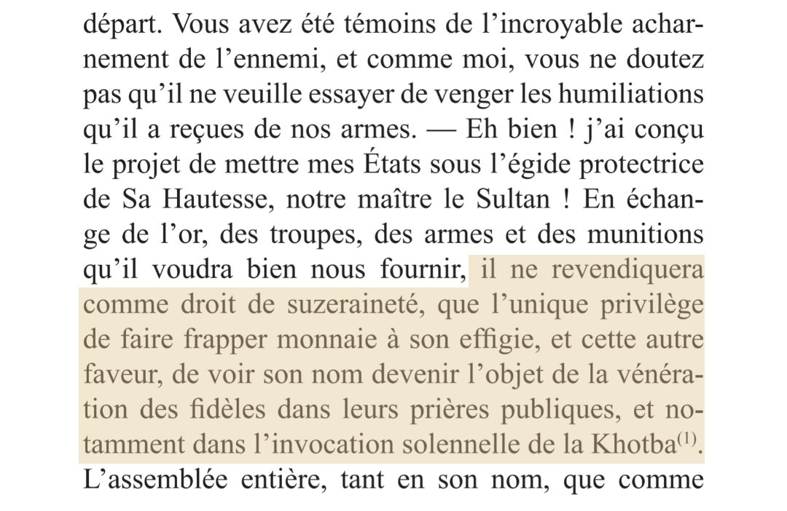
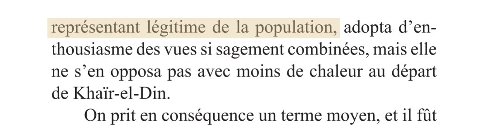
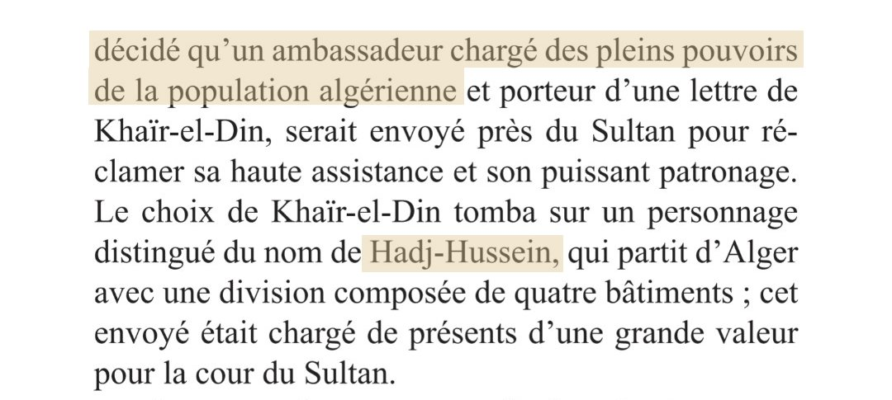

Après une série de victoires majeures contre les Espagnols, notamment à Jijel, Béjaïa, Alger et Tlemcen, grâce à l'aide précieuse des Algériens, khayr ad-Din Aroudj, dit « Barberousse », désirant retourner dans son pays,  décide de réunir les oulémas et les notables en assemblée et les informe de sa décision.
 
Malgré la demande insistante de l'assemblée pour qu'il renonce à son départ, Barberousse demeure résolu à partir. Il annonce sa décision de placer le royaume d’Alger sous la protection de la sublime porte. Il assure à l'assemblée que le sultan revendiquera comme droit de suzeraineté, que de faire frapper la monnaie à son effigie et de « voir son nom devenir l’objet de vénération des fidèles dans leurs prières publique et notamment dans l’invocation solennelle de la Khotba ».
 
  
 
 Extrait du livre Traduction du manuscrit arabe El Zohrat  El Nayerat de Muhammad Ibn Muhammad Al-Tilimsani
 
Lire aussi:  <a href='article/arbre-genealogique-des-rois-numides'> Arbre généalogique des rois numides</a>
 
L'assemblée, représentant de la population algérienne, finit par accepter la proposition de  khayr ad-Din Barberousse. Un ambassadeur algérien, du nom de Hadj-Hussein, est chargé de présenter cette proposition au sultan de la sublime porte. Cet émissaire est porteur d'une lettre exposant en détail le projet élaboré lors de cette assemblée. 
 
 
  
 
  
 
 
 Extrait du livre Traduction du manuscrit arabe El Zohrat  El Nayerat de Muhammad Ibn Muhammad Al-Tilimsani
 
 
 
Source: Source :  Traduction du manuscrit arabe El Zohrat El Nayerat de Muhammad Ibn Muhammad Al-Tilimsani 
 