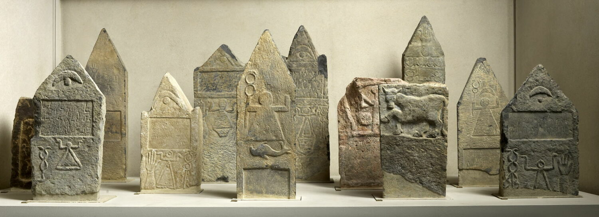

<h1>Stèles de Cirta : Vestiges de la présence des communautés grecques et latines dans la capitale numide</h1>

Cirta, l'antique capitale du royaume de Numidie, aujourd'hui Constantine en Algérie, était un centre urbain où se croisaient diverses cultures.

Les Berbères y vivaient aux côtés de populations étrangères, tels que les Puniques, les Grecs et les Romano-Italiens. Ces étrangers jouaient des rôles variés : Massinissa, par exemple, fit appel à des musiciens grecs, tandis que son fils bénéficia d'une éducation hellénique auprès de philosophes grecs. Son fils et successeur, Micipsa, fréquenta un cercle d’érudits grecs et s’intéressa à diverses disciplines, dont la philosophie. On trouvait également dans la capitale numide des mercenaires et des prêtres.

<h2>Les stèles comme témoignages archéologiques</h2>

Les découvertes archéologiques sur la colline d'El Hofra, effectuées entre 1875 et 1950, ont mis au jour de nombreuses stèles, dont certaines remontent à l'époque de Massinissa. Ces vestiges, portant des inscriptions en grec et en latin, constituent des témoignages précieux des pratiques religieuses et culturelles de l'époque. Les dédicaces gravées sur ces stèles nous renseignent sur la composition sociale de la cité et les interactions entre les différentes communautés.

<h2>Conservation et héritage culturel</h2>

Cette présence suggère des interactions fréquentes avec des cultures étrangères, que ce soit dans le commerce ou les échanges intellectuels, contribuant ainsi à la richesse culturelle de cette époque.

Ces stèles de Cirta offrent un aperçu unique sur l’influence des cultures grecques et latines en Numidie, faisant de Constantine un centre historique d’interaction culturelle préservé au Musée national Cirta et au Louvre.

    

 

 Source : Source : Bertrandy, F. (1985). La communauté gréco-latine de Cirta (Constantine), capitale du royaume de Numidie, pendant le IIe siècle et la première moitié du Ier siècle avant J.-C. Latomus, 44(3), 488-502 
 

